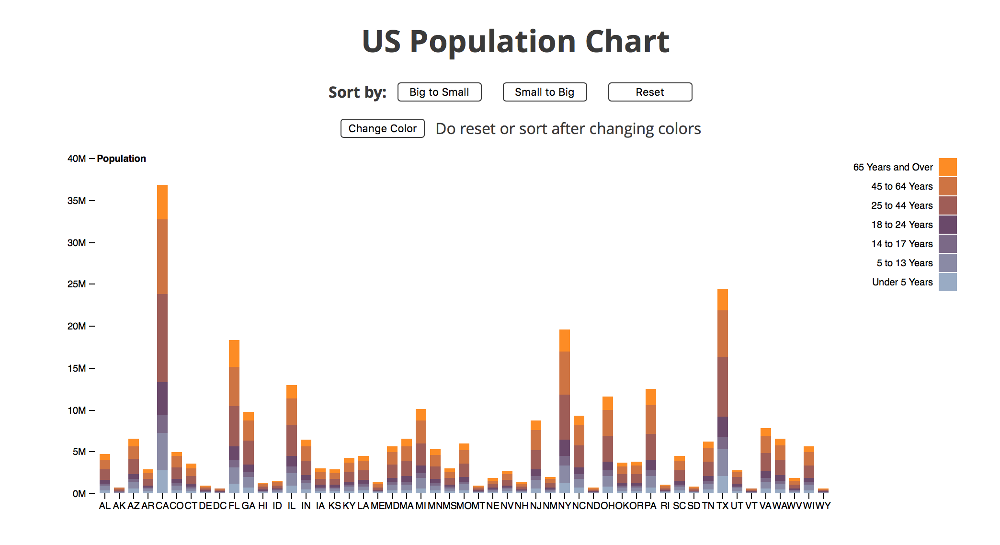

# Playing with D3.js
To learn D3.js I have copied and modified a example from [bl.ocks.org](https://bl.ocks.org) to fiddle around a bit.

Source code: [Bar chart source](https://bl.ocks.org/mbostock/3886208) by [@mbostock](https://github.com/mbostock) (GPL-3.0).

## Background
A stacked bar chart of the US Population. I played around a bit with the existing code to implement sorting and rerendering the chart.

## Data
- Data format CSV with 51 rows and 7 columns.
- Data structure:
	- `State`
	- Labels of `years/ages`

The visualisation is a stacked bar chart divides over the corresponding US states.

## Features
The following D3 API's were used:
- [`d3-request`](https://github.com/d3/d3-request)
	- d3.csv - get a comma-separated values (CSV) file
- [`d3-scale`](https://github.com/d3/d3-scale)
	- d3.scaleOrdinal -- create an ordinal scale
	- d3.scaleBand --  create an ordinal band scale
	- d3.scaleLinear -- create an linear scale
	- d3.domain -- set the input domain
	- d3.range -- set the output range
	- d3.rangeRound -- set the output range and enable rounding
	- d3.paddingInner -- set padding between bands
	- d3.align -- set band alignment, if there is extra space
	- d3.bandWidth -- get the width of each band
- [`d3.selection`](https://github.com/d3/d3-selection)
	- d3.select -- select an element from the document
	- d3.selectAll -- select multiple elements from the document
	- d3.append -- create, append and select new elements
	- d3.attr -- get or set an attribute.
	- d3.remove -- remove elements from the document
	- d3.enter -- get the enter selection (data missing elements)
	- d3.data -- join element to data
	- d3.text -- get or set the text content
	- selection.on - add or remove event listeners
	- selection.select - select a descendant element for each selected element
	- selection.selectAll - select multiple descendants for each selected element
- [`d3.axis`](https://github.com/d3/d3-axis)
	- d3.axisBottom -- create a new bottom-oriented axis generator
	- d3.axisLeft -- create a new left-oriented axis generator
- [`d3.shape`](https://github.com/d3/d3-shape)
	- d3.stack -- create a new stack generator

## Added Features
These are the features added:
- Sorting the data from largest to smallest number and vice-versa
- Resetting the chart back to it's original setting (A-Z)
- Change the colorscheme

*NOTE - You do need to reset or sort again to let the new colors come through*

## License

GPL-3.0 © Kang Yun Wang (Kevin Wang)

